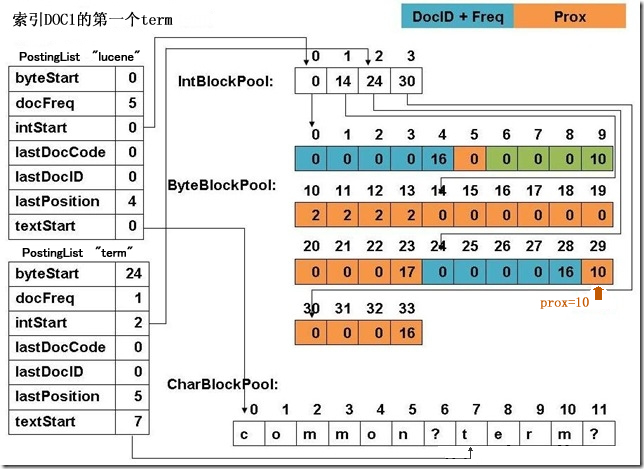

## 倒排索引要存哪些信息
&emsp;&emsp;提到倒排索引，第一感觉是词到文档列表的映射，实际上，倒排索引需要存储的信息不止词和文档列表。为了使用余弦相似度计算搜索词和文档的相似度，需要计算文档中每个词的[TF-IDF](https://en.wikipedia.org/wiki/Tf%E2%80%93idf)值，这样就需要记录词在每个文档中出现的频率以及包含这个词的文档数量，前者需要对应每个文档记录一个值，后者就是倒排表长度。除此以外，为了能够高亮搜索结果，需要记录每个词在文档中的偏移信息（起始位置和长度），为了支持短语查询，需要记录每个词的position信息，注意position和offset不是一个概念，position是文档分词之后得到的term序列中词的位置，offset是分词之前的偏移，如果文档中一个词被分成多个Term，那么这些Term将共享同一个position，典型场景是同义词，这在自然语言处理中很有用。如果用户希望在Term级别干预查询打分结果，那么就需要对文档中的每个词存储额外的信息（payload）。

&emsp;&emsp;综上，倒排索引需要存储的信息主要有以下几方面：
-  词（Term）
-  倒排文档列表（DocIDList）
-  词频（TermFreq）
-  Position
-  Offset
-  Payload

&emsp;&emsp;有几点需要特别说明，lucene中Term是对每个Field而言的，也就是说在Document不同Field中出现的相同字面的词也算不同的Term。搞清楚了这一点，就很容易理解TermFreq、Position、Offset、Payload都是在一个Document中Field下的统计量。另外，同一个Term在同一个Document的同一个Field中，Position、Offset、Payload可能会出现多次，次数由TermFreq决定。

**lucene中倒排索引的逻辑结构如下：**
```
|+ field1(name,type)
	|+ term1
		|+ doc1
			|+ termFreq = 2
				|+ [position1,offset1,payload1]
				|+ [position2,offset2,payload2]
		|+ doc2
			|+ termFreq = 1
				|+ [position3,offset3,payload3]
		|+...
	|+ term2
	|+...
|+ field2(name,type)
|+ ...
```
## lucene建索引的过程
&emsp;&emsp;上面倒排索引的逻辑结构贯穿lucene的始终，lucene建索引的不同阶段对应逻辑结构的某种具体实现。

&emsp;&emsp;分词阶段所有倒排信息被缓存在内存中，随着缓存的数据越来越多，刷新逻辑会被触发（FlushPolicy），内存中缓存的数据会被写入外存，这部分被写入外存的数据称为段（Segment），段是倒排索引逻辑结构的另外一种表示方式，lucene使用有限状态转移自动机（FST）来表示，这一块后面会有文章深入讨论，本篇文章主要讨论内存中缓存对倒排索引逻辑结构的实现方式。再多说几句为什么lucene会使用段这一概念。首先，lucene建索引是线程安全的，线程安全的实现方式很高效，一般的实现线程安全的方式是对临界变量加锁，lucene没有采用这种方式。用一个比喻来形容lucene的方式，假如对临界变量加锁的方式是多个人在一个工作间里工作，共享这个工作间里的工具，lucene就是给每个人一个工作间，大家工作时互不干扰。这样每个人的工作成果就可以同时输出，效率自然就高了很多，这里的工作成果便是段。其次，机器的内存资源是有限的，不可能把所有数据都缓存在内存中。最后，从查询的角度看，将查询条件分发给多个段同时查询最后再merge各个段的查询结果的方式比单一段查询效率要高。当然，事物总是矛盾的，有利必有弊，使用段的方式给索引管理带来了很大的难度，首当其冲便是索引的删除，用户下发删除Query，这些Query要应用到所有已经存在的段上，如果同时应用删除操作，磁盘IO必将受不了，lucene选择的删除时机是在段合并的时候，在这之前，删除Query会被缓存起来，这又带来另一个问题，如果每个段要维护自己的删除Query内存必然受不了，怎么让所有段共享删除Query。使用段带来的另一个复杂度便是段的合并。在多少个段上同时查询效率最高是一个需要权衡的问题，段太多太少都会导致查询很慢，因此段合并策略很重要。上面提到的这些都会在接下来的文章中深入讨论。

&emsp;&emsp;回到本篇文章的主题，内存缓存是怎么实现上面的倒排索引的逻辑结构的。

## 缓存实现倒排索引逻辑结构的方式
&emsp;&emsp;首先来看下Term、DocIdList、TermFreq、Position、Offset、Payload产生的时间点。Term刚开始分词的时候就有，根据上面的讨论，这个时候Position、Offset、Payload也都产生了，也就是说分词结束，Term、Position、Offset、Payload就都可以写到缓存里面，TermFreq这个时候还没有得到最终的值，主要有两点原因，第一，这里讨论的缓存都是针对Field而言的，如果一个Document里面包含多个相同的Field，这些相同的Field显然要被写到同一个缓存里面，同一个Term在这些Field里可能会出现多次，每次出现TermFreq就要加1。第二，一个Field中Term也可能会出现多次。基于以上两点，只有当遇到下一个Document的时候前一个Document的各个TermFreq的值才能够固定，这个时候就可以将TermFreq和DocId一起写到缓存。

&emsp;&emsp;lucene里面实现缓存的最基础的组件是``org.apache.lucene.util.ByteBlockPool``，lucene的缓存块都是基于这个类构建的，这个类的官方解释如下：

 > &emsp;&emsp;The idea is to allocate slices of increasing lengths For example, the first slice is 5 bytes, the next slice is 14, etc.  We start by writing our bytes into the first 5 bytes.  When we hit the end of the slice, we allocate the next slice and then write the address of the new slice into the last 4 bytes of the previous slice (the "forwarding address").
 
> &emsp;&emsp;Each slice is filled with 0's initially, and we mark the end with a non-zero byte.  This way the methods that are writing into the slice don't need to record its length and instead allocate a new slice once they hit a non-zero byte.

&emsp;&emsp;具体实现请直接参考源码，实现很简单，类的功能是可以将字节数据写入，但是不要求写入的逻辑上是一个整体的数据在物理上也是连续的，将逻辑上的数据块读出来只需要提供两个指针就好了，一个是逻辑块的物理起始位置，一个是逻辑块的物理结束位置，注意逻辑块的长度可能是小于两个结束位置之差的。ByteBlockPool要解决的问题可以联系实际的场景来体会下，不同Term的倒排信息是缓存在一个ByteBlockPool中的，不同Term的倒排信息在时序上是交叉写入的，Term到达的顺序可能是``term1,term2,term1``，并且每个Term倒排信息的多少是无法事先知道的。

&emsp;&emsp;ByteBlockPool解决的另一类问题是时序上顺序的数据，比如Term，虽然整体上看Term到达的顺序可能是``term1,term2,term1``这样交叉的情况，但是Term数据有的一个特点是只会被写到缓存块中一次。

&emsp;&emsp;上面提到的ByteBlockPool解决的两类问题对应两类缓存块，[DocIDList,TermFreq,Position,Offset,Payload]缓存块和Term缓存块，前一个缓存块存放的是除了Term字面量外余下的数据。完整的倒排信息不止这两个缓存块，怎么将两个缓存块联接起来构建成倒排索引，还需要有其他的数据。

&emsp;&emsp;下面是别人画的一张图，lucene3.0的实现，很老了，但是整体上思路没有变。



&emsp;&emsp;左侧是PostingList，每个Term都有一个入口，其中byteStart字段存放的是之前提到的这个Term对应的倒排信息[DocIDList,TermFreq,Position,Offset,Payload]在缓存块中的物理偏移，textStart用于记录该Term在Term缓存块中的偏移，lucene5.2.1中，Term缓存块没有用CharBlockPool，而是用ByteBlockPool。上文提到DocID、TermFreq的写入时机和Position、Offset、Payload是不一样的，因此lucene在实际实现中并没有将[DocIDList,TermFreq,Position,Offset,Payload]当成一个数据块，而是分成了两个数据块[DocIDList,TermFreq]和[Position,Offset,Payload]，这样为了获得这两块数据就需要记录四个偏移地址，但lucene并没有这样做。byteStart记录[DocIDList,TermFreq]的起始偏移地址，[Position,Offset,Payload]的偏移地址可以通过byteStart计算出来，要理解这一点需要理解ByteBlockPool是怎么实现逻辑上连续的数据物理上离散存储的，这一块不打算展开，感兴趣的读者请直接看ByteBloackPool的源码，类似于链表的结构，链表的Node对应这里叫做Slice，Slice的末尾会存放Next Slice的地址。其实之前提到的两个物理偏移就对应头Slice的起始位置和尾Slice的结束位置。数据块[DocIDList,TermFreq]和[Position,Offset,Payload]的头Slice是相邻的，所有头Slice的大小都是相同的，因此[Position,Offset,Payload]的开始位置很容易从byteStart推算出。这样只需要记录三个偏移地址就够了，byteStart、[DocIDList,TermFreq]块的结束位置、[Position,Offset,Payload]块的结束位置。后两个信息lucene将其为维护在一个IntBlockPool中，IntBlockPool和ByteBlockPool的区别仅仅是存储的数据类型不同，PostingList中记录下这两个偏移在IntBlockPool中的偏移。

&emsp;&emsp;上图中左侧除了上面讨论的外，可以看到还有lastDocID、lastPosition等，这些都是为了做差值编码，从而节约存储。这里还有个问题需要说明下，新到达的Term，怎么判断其是新的还是已经存在了。针对这个问题lucene对Term做了一层Hash，对应的类是``org.apache.lucene.util.BytesRefHash``,功能解释如下：
> &emsp;&emsp;BytesRefHash is a special purpose hash-map like data-structure optimized for BytesRef instances. BytesRefHash maintains mappings of byte arrays to ids. storing the hashed bytes efficiently in continuous storage. The mapping to the id is encapsulated inside BytesRefHash and is guaranteed to be increased for each added BytesRef.

&emsp;&emsp;综上所述，lucene对缓存的实现可谓煞费苦心，之所以做的这么复杂我觉得有以下几点考虑：
- 节约内存。比如用那个三个指针记录两个缓存块的偏移、Slice长度的分配策略、差值编码等。
- 方便对内存资源进行控制。几乎所有数据都是通过BlockPool来管理的，这样的好处是内存使用情况非常容易统计，FlushPolicy很容易获取当前的内存使用情况，从而触发刷新逻辑。

下一篇将介绍上面的逻辑倒排结果在段中是怎么表示的，也就是缓存怎么刷到外存上的。
