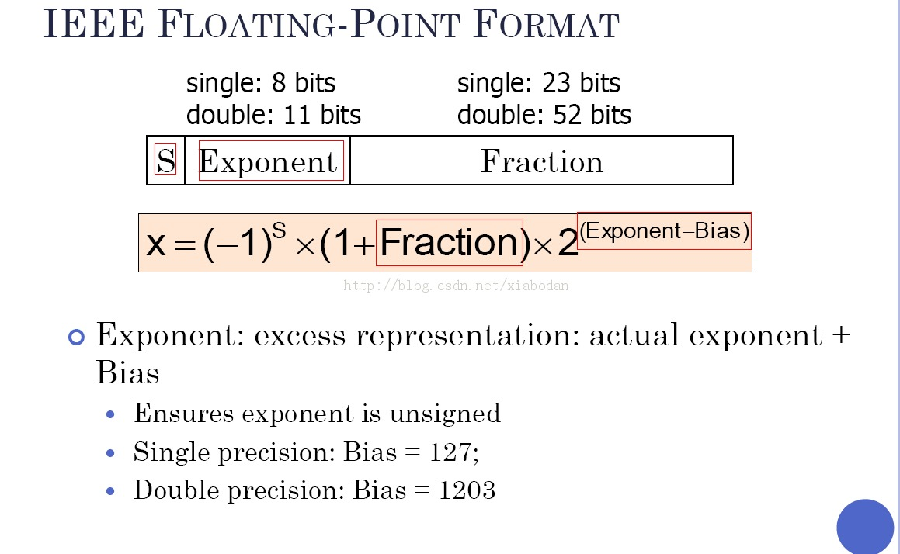

本文讨论lucene数值类查询的原理，将分三部分阐述，分别是数值转换成可比较的字符串、数值分词、数值区间查询。为了便于大家理解，有些地方没有完全按照lucene的方式说明，但是和lucene是等价的。
## 数值转换成可比较的字符串
Lucene主要用于全文检索，其设计都是围绕文本进行的，Term的编码方式是UTF8字符串(byte数组)，对于数值数据，lucene索引的思路是将数值型转换成可比较的字符串。
假设有任意两个浮点数x和y，分别转换成字符串a和b，lucene要求String.Compare(a,b) == Double.Compare(x,y)。
Lucene的做法如下：<br/>
*Step 1:*将浮点数转换成IEEE754格式。<br/>

*Step 2:*如果S==0，将S翻转。如果S==1，将整体翻转。<br/>
*Step 3:*从左向右每7bit看作一个ASCII码，尾部不够低位补0，构造字符串。<br/>
UTF8编码在当字符只需要一个byte时，最高位是0，其余是数据，此时等价于ASCII码。
经过上述步骤构造的字符串满足String.Compare(a,b) == Double.Compare(x,y)。
## 数值分词
之前一次分享中提到lucene加快数值类区间查询速度的方法是构建后缀树。这里需要纠正下，lucene并不会真正的构建后缀树索引，而是利用后缀树索引的思想进行数值分词以及切分查询区间。<br/>
以32bit数据data = 0x12334AEF为例子讲述分词过程（此数由32位浮点数转换而成）。<br/>
分词之后的Term是UTF8编码的，使用多个byte表示，第一个byte是标志位，用以表示数据类型以及数据偏移，假设此数是Float类型，类型标志0x20。分词就是将数据不断向右移位（多位）构造Term的过程，这样数据偏移的概念就很好理解了，每次移位都是数据偏移的整数倍。由于转成ASCII前后并不会影响数据的可比较性，接下来的讨论将省去构造ASCII码的过程。假设数据偏移为8。分词过程如下：<br/>
ASCII码的过程。假设数据偏移为8。分词过程如下：<br/>
*Step 1:*数据偏移shift =8，迭代步骤i=0;<br/>
*Step 2:*数据右移i\*shift位，构造第一个byte[0]=0x20|(i\*shift)，将移位之后剩下的数据顺序填充到byte数组中，一个Term就构造好了。<br/>
*Step 3:*++i，如果i==sizeof(data)/shift停止，否则重复Step 2.<br/>
数据data = 0x12334AEF经过上述分词之后会得到4个Term如下：<br/>
0x2012334AEF<br/>
0x2812334A<br/>
0x301233<br/>
0x3812<br/>
数据偏移越小，Term越多，lucene索引越大。不同数据类型其标志位是不一样的，标志位的选择要考虑到最多可以右移的位数。<br/>
Lucene中每一个Term后面都是一个文档列表，这就是倒排索引，分词之后当前文档会被加到上述四个Term的文档列表中。<br/>
通过一个例子来看下lucene为什么要这样做：<br/>
假设要查询Term范围是[0x2012334A00, 0x2012334AFF]的所有文档，一般的做法是遍历范围内的所有Term，合并每一个Term的倒排表，效率很低，lucene的做法是将其看作一个Term 0x2812334A，直接返回其倒排表。当然如果上述范围内缺少任意一个或多个Term就不可以合并。<br/>
再看一个例子，查询范围是[0x2012330000, 0x281233FF]，lucene将其合并成一个Term 0x301233。过程是首先将区间分裂成[0x2012330000, 0x28123300FF]，[0x28123301, 0x281233FF]，合并前一个区间为0x20123300，加到后面区间上得到[0x28123300, 0x281233FF]，再合并得到0x301233。<br/>
## 数值区间查询
从上面最后的讨论可以了解到，lucene在做数值范围查询时会将查询区间进行切分和合并。切分和合并的过程比较朴素的步骤如下：<br/>
*Step 1:*迭代查询区间内的所有数，对每一个数进行分词，构造链结构。<br/>
0x12334AEF构造的链结构如下：<br/>
0x3812->0x301233->0x2812334A->0x2012334AEF<br/>
*Step 2:*对所有的链构造前缀树。<br/>
*Step 3:*假如某个节点其孩子包含了最小值到最大值之间的所有数，那么就说该节点是完全的。从底向上，删掉后缀树中完全节点的孩子节点。<br/>
*Step 4:*对树中余下的叶子节点构造Query。属于同一个父亲的叶子节点构造RangeQuery，单独的叶子构造TermQuery，将所有Query插入链表，按照Term对链表中Query排序。<br/>
Lucene的实现比上面的方法高效的多，其并不会构建后缀树。代码如下：<br/>
```java
  private static void splitRange(
    final Object builder, final int valSize,
    final int precisionStep, long minBound, long maxBound
  ) {
    if (precisionStep < 1)
      throw new IllegalArgumentException("precisionStep must be >=1");
    if (minBound > maxBound) return;
    for (int shift=0; ; shift += precisionStep) {
      // calculate new bounds for inner precision
      final long diff = 1L << (shift+precisionStep),
        mask = ((1L<<precisionStep) - 1L) << shift;
      final boolean
        hasLower = (minBound & mask) != 0L,
        hasUpper = (maxBound & mask) != mask;
      final long
        nextMinBound = (hasLower ? (minBound + diff) : minBound) & ~mask,
        nextMaxBound = (hasUpper ? (maxBound - diff) : maxBound) & ~mask;
      final boolean
        lowerWrapped = nextMinBound < minBound,
        upperWrapped = nextMaxBound > maxBound;
      
      if (shift+precisionStep>=valSize || nextMinBound>nextMaxBound || lowerWrapped || upperWrapped) {
        // We are in the lowest precision or the next precision is not available.
        addRange(builder, valSize, minBound, maxBound, shift);
        // exit the split recursion loop
        break;
      }
      
      if (hasLower)
        addRange(builder, valSize, minBound, minBound | mask, shift);
      if (hasUpper)
        addRange(builder, valSize, maxBound & ~mask, maxBound, shift);
      
      // recurse to next precision
      minBound = nextMinBound;
      maxBound = nextMaxBound;
    }
  }
```
Lucene索引中Term是有序的，切分好的Query也是有序的，除此之外，lucene4.x为了加快Term的查询速度，采用FST(有限状态自动机)对Term做前缀标记，FST可以指出以abc为前缀的Term块起始位置，在块内lucene4.x又使用跳跃表进行查询加速，所以lucene seek到指定Term的速度是很快的。需要seek的Term数量仅仅是Query中Distinct的Term数量。最坏情况下查询复杂度就是Query中Distinct Term的数量。<br/>
迭代N bit数的取值范围，假设偏移是k，对每一个数进行分词，构建后缀树，这样的后缀树称为完全后缀树，最坏情况下的查询区间由最底层的第二个叶子和倒数第二个叶子构成。此时需要Seek的Term数量为：<br/>
```
(2^k-1)×2×(N÷k-1)+2^k-2
```
## 附录
- [作者主页](http://www.thetaphi.de/)
- [lucene邮件组中TrieRangeQuery的commit申请](http://www.gossamer-threads.com/lists/lucene/java-dev/67807)
- [作者介绍这个算法的ppt](https://www.google.com.hk/url?sa=t&rct=j&q=&esrc=s&source=web&cd=1&cad=rja&uact=8&ved=0CB8QFjAAahUKEwi07fH7r4THAhXILpQKHc_PCPQ&url=%68%74%74%70%3a%2f%2f%77%77%77%2e%74%68%65%74%61%70%68%69%2e%64%65%2f%73%68%61%72%65%2f%53%63%68%69%6e%64%6c%65%72%2d%54%72%69%65%52%61%6e%67%65%2e%70%70%74&ei=ZOS6VbSrFsjd0ATPn6OgDw&usg=AFQjCNHDWZaW472jl9Pn4epskF52ccuf3w)
